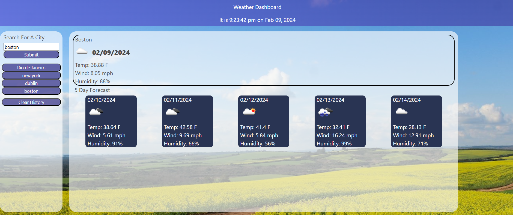

# Week 6 Project: Weather Dashboard

## Description

Welcome to my Weather Dashboard! This project was created as a way to get general weather information about 
a city without too much hassle or complication. it eliminates the need to look at convaluted weather websites 
or apps with a million buttons. I learned a lot about apis and what it takes to receive and manipulate data.
The deployed project can be found [here](https://vzachary13.github.io/fluffy-broccoli/)

## Usage

to interact with the application you must enter a valid city name. The more prominent a location the likelier you are to receive the correct weather station.
once a city is enter the display will populate with labels and corresponding weather data. additionally, your search is saved as a button on the left-hand side of the page.
clicking this button is the same as typing that entry again and hitting submit. should you desire, or the history gets too long, a clear history button is available to clear your search history. this process is not reversable however your browser may save some entries as options when you type into the input bar.

## How to Contribute

Contributions are not being acceted at this time.
